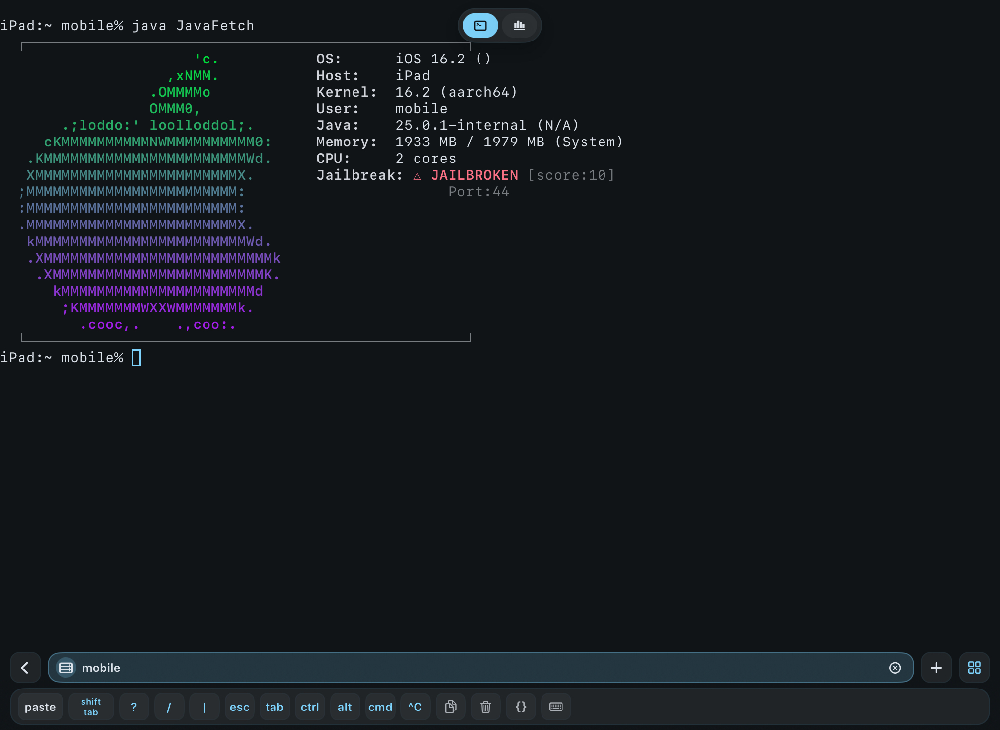

# JavaFetch

[English](#english) | [中文](#中文)

---

## English

Cross-platform system information tool, Neofetch-style ASCII art (supports iOS)

### Features

-Identify common Linux distributions, Android, Windows, and iOS
-Identify system information, display username
-` Javafetch. conf ` configurable colors and icons

### Build

JDK 17+ required.

```bash
./build.sh
```

### Run

```bash
java -jar JavaFetch.jar
```
## Screenshot



## License

[MIT](LICENSE.md)

## 简体中文

跨平台系统信息工具，Neofetch风格ASCII艺术画（支持iOS）

### 功能

- 识别Linux常见发行版本、Android、Windows以及iOS
- 识别系统信息，用户名显示
-  `javafetch.conf` 可配置颜色和图标

### 构建

需要 JDK 17+。

```bash
./build.sh
```

### 运行

```bash
java -jar JavaFetch.jar
```

## Configuration · 配置

Edit `config/javafetch.conf`.

### Colors · 颜色

```ini
[COLORS]
Ubuntu  = 255,102,0
Arch    = 23,147,209
macOS   = 0,220,60 > 160,30,230
```

`R,G,B` for solid. `R1,G1,B1 > R2,G2,B2` for gradient.

### Logos · 图标

在`[UBUNTU]`、`[ARCH]`、`[IOS]`等下粘贴ASCII字符画。使用`{EMPTY}`表示空白行。

### Section Names · 节名

`UBUNTU`, `DEBIAN`, `ARCH`, `MANJARO`, `FEDORA`, `CENTOS`, `RHEL`, `OPENSUSE`, `KALI`, `MINT`, `POP`, `GENTOO`, `RASPBIAN`, `ENDEAVOUROS`, `ALPINE`, `VOID`, `NIXOS`, `MACOS`, `IOS`, `WINDOWS`, `ANDROID`, `UNKNOWN`

## 截图


## License

[MIT](LICENSE.md)

